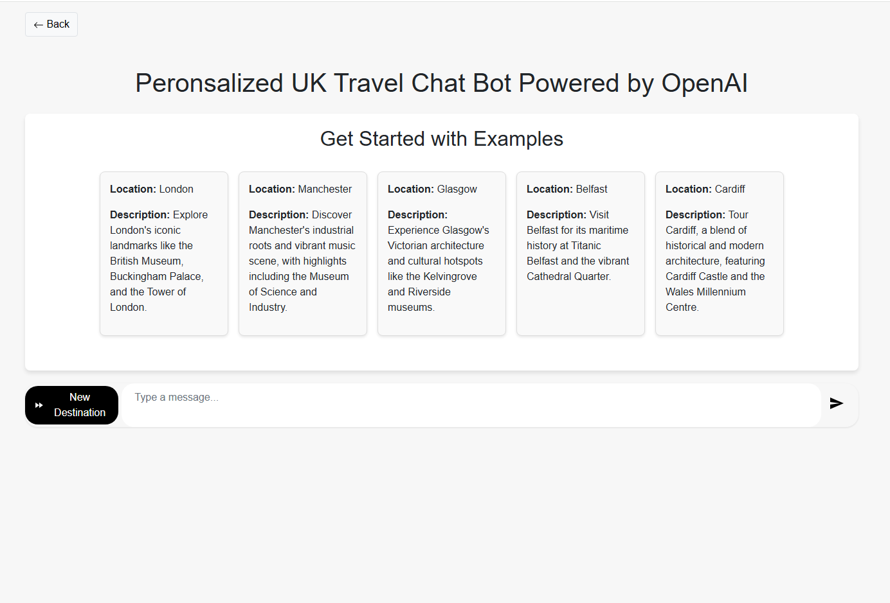
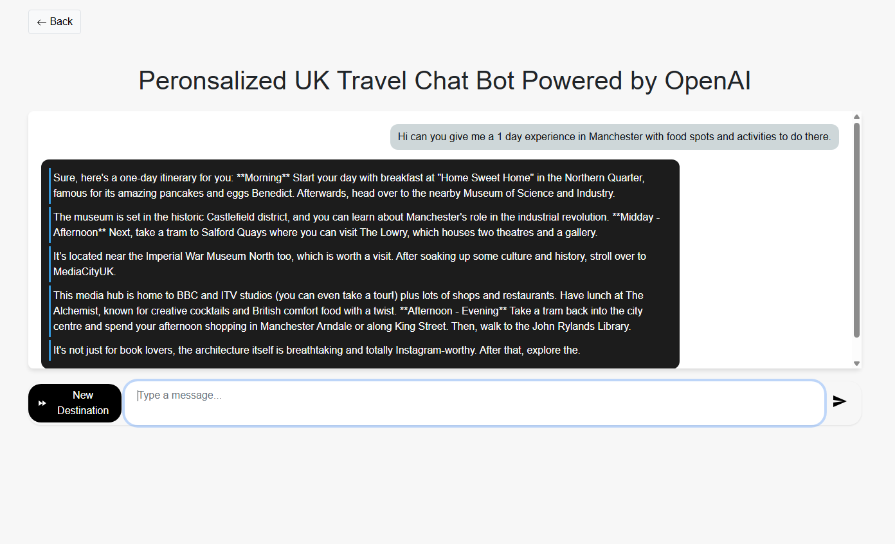
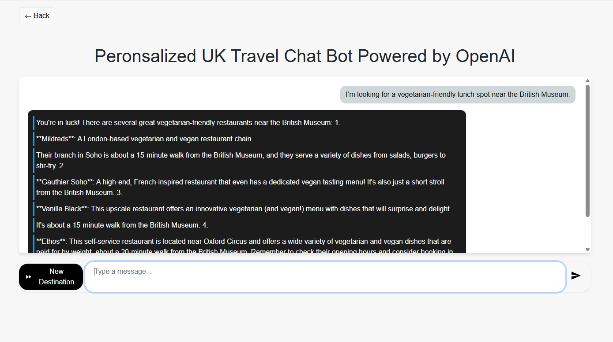

# Project: AI UK Travel Guide Chatbot


## Table of Contents

- [Project Overview](#project-overview)
- [Features](#features)
- [Live Demo](#live-demo)
- [Getting Started](#getting-started)
- [Detailed Report](#detailed-report)

---

<h2 id="project-overview">Project Overview</h2>

Planning a trip can feel overwhelming, especially with a flood of travel blogs, booking sites, and endless search results at your fingertips. Imagine if organising a trip to the UK felt more like chatting with a knowledgeable friend. That’s the core idea behind this project. Someone who understands your preferences, knows where to find the best food, and can offer real-time suggestions for places to explore.

My final-year dissertation revolved around creating a chatbot that acts as an AI-powered travel companion. The aim was to enhance the experience of planning a trip to the UK, making it quicker, smarter, and more tailored to individual needs. Through engaging conversations, the chatbot utilises Natural Language Processing (NLP) and real-time APIs to provide users with personalised suggestions for dining, places to stay, transportation options, and attractions to explore.

As I worked on the project, I concentrated on making the experience easy to navigate for non-technical users, while also building a powerful and scalable backend that could handle dynamic requests seamlessly. Key features include:

- Custom NER (Named Entity Recognition) to extract location, food, and activity preferences
- Synonym matching and intent detection to better understand user goals
- Real-time data integration via APIs for up-to-date local recommendations
- Stateful trip planning that builds an itinerary over multiple chat turns

I ran into a few bumps while training and rolling out a tailored spaCy NER model, particularly with its size and integration issues. However, I was able to overcome these challenges by creating a more streamlined version that still offered strong entity recognition. This process of learning and adjustment significantly improved the system's performance and dependability.

In the long run, the chatbot evolved from a simple tech development into a great illustration of how artificial intelligence can help with everyday tasks, like planning a trip, making them easier, more relatable, and even a bit of fun.

---

<h2 id="features">Features</h2>

- **Conversational AI with Advanced NLP:** </br> The chatbot uses a finely-tuned NER model, built on spaCy’s `en-core-web-sm`, to effectively pinpoint locations, food, and activities from what users ask. This allows for smooth, human-like conversations that are specifically designed for UK travel. </br>
- **Personalised Recommendations:** </br> By keeping an eye on what users prefer during chats, the chatbot tailors its suggestions for things like attractions, dining, places to stay, and transportation. This makes planning a trip feel more personal and enjoyable. </br>
- **Real-Time Data Integration:** </br> Services such as Google Maps and Yelp tap into external APIs to deliver real-time updates on nearby points of interest, dining options, and events. This ensures that the suggestions you get are not only precise but also timely.
- **Scalable and Responsive Backend:** </br> The system is built to support numerous users at once and maintains quick response times, usually less than 10 seconds for general enquiries, to ensure seamless and fulfilling interactions.
- **Accessible and User-Friendly Interface:** </br> With its clean, minimalist design and easy-to-read typography paired with high-contrast chat bubbles, the interface is designed for effortless navigation and readability. It also adheres to accessibility standards, making it user-friendly for everyone, regardless of their needs.
- **Intuitive Conversation Flow:** </br> Users are guided through trip planning effortlessly with clickable suggestions and contextual responses, making the whole experience feel seamless and engaging, much like having a knowledgeable travel companion to chat with.

---

<h2 id="live-demo">Live Demo</h2>

You can access the live demo of the AI Travel Guide project [here](https://ai-travel-guide-30f005e79499.herokuapp.com/).  
*Note: The live demo is currently deactivated to avoid ongoing costs but may be reactivated in the future.*

Meanwhile, here are some screenshots showcasing the project in action:

  
*Initial Page for AI Travel Guide chatbot.*

  
*The chatbot generating personalised travel recommendations.*

 
*Example interaction with the AI Travel Guide chatbot.*

---

<h2 id="getting-started">Getting Started</h2>

Follow these steps to get the AI Travel Guide chatbot running on your local machine.

### Prerequisites

Before you begin, make sure you have the following installed:

- [Python 3.x](https://www.python.org/downloads/)
- [Visual Studio Code](https://code.visualstudio.com/)

### Installation

1. **Unzip the project folder** if it was provided as a `.zip` file.
2. **Open the folder** named `Synoptic-Project` in Visual Studio Code.
3. **Open a new terminal** inside VS Code:  
   Go to `Terminal > New Terminal`.

4. **Create a virtual environment** by running:

   ```bash
   python -m venv myenv
   ```
5. **Activate the virtual environment** by running:

   **Windows:**
   ```bash
   myenv\Scripts\activate
   ```

   **Mac/Linux:**
   ```bash
   source myenv/bin/activate
   ```
6. **Install the dependencies** by running:

   ```bash
   pip install -r requirements.txt
   ```
7. **Verify your packages** are installed correctly by running:

   ```bash
   pip list
   ```

### Running Locally

1. **Start the application** by running in terminal:

   ```bash
   python runserver.py
   ```
2. **Open your browser** and go to:

   ```cpp
   http://127.0.0.1:8080
   ```
3. **Access the chatbot** by clicking the "Let's Chat" button or navigating from the navbar.
4. When you're done, **stop the server** by pressing `Ctrl + C`
5. **Deactivate** the virtual environment by running:

   ```bash
   deactivate
   ```

---

<h2 id="detailed-report">Detailed Report</h2>

If you’re looking for a detailed overview of the project, complete with technical specifics, evaluations, and background information, check out my full dissertation report

<a href="assets/Ahmed_Zakir_Report.pdf" target="_blank" rel="noopener noreferrer">
  Ahmed Zakir — AI UK Travel Guide Chatbot Dissertation (PDF)
</a>
